# AS Heart Disease Prediction

AS Heart Disease Prediction is an Android application designed to help users assess their risk of heart disease using machine learning(XGBoost) prediction models. The app also features a chatbot for health-related queries and a hospital finder to locate nearby medical facilities.

> **Disclaimer:** This app provides AI-supported health information and is **NOT** a substitute for professional medical advice, diagnosis, or treatment. Always consult a qualified healthcare provider for any medical concerns.

## Features

*   **Heart Disease Prediction**:
    *   **Standard Prediction**: User-friendly interface for quick risk assessment based on common health metrics (age, blood pressure, cholesterol, symptoms, etc.).
    *   **Healthcare/Doctor Prediction**: Advanced mode for healthcare professionals with more detailed input parameters.
*   **AI Health Chatbot**: An integrated chatbot to answer general health-related questions.
*   **Hospital Finder**: Automatically locates and lists nearby hospitals based on the user's current location, including distance and contact details.
*   **Privacy-Focused**: Comprehensive privacy policy and data handling transparency.
*   **Onboarding Flow**: Clear disclaimer and "How it works" section to ensure users understand the app's purpose and limitations.

## Tech Stack

*   **Language**: Kotlin
*   **UI Framework**: Jetpack Compose (Material 3)
*   **Architecture**: MVVM (Model-View-ViewModel)
*   **Networking**: Retrofit, OkHttp, Gson
*   **Backend Integration**: Connects to a local Python/FastAPI backend for ML predictions and LLM processing.
*   **Services**:
    *   **Firebase**: Authentication and Firestore.
    *   **Google Places API**: For finding hospitals and fetching details.
    *   **Google Maps SDK**: For location services.
    *   **Dify**: For LLM-based explanations and chat workflows.

## Prerequisites

*   Android Studio (latest version recommended)
*   JDK 11 or higher
*   **Python 3.8+**
*   Firebase Project (for `google-services.json`)
*   Google Cloud Project with **Places API**, **Maps SDK for Android**, and **Distance Matrix API** enabled.
*   **Dify Account**: Access to Dify API for workflows and chat.

## Setup & Installation

### 1. Backend API Setup (Python)

The Android app requires the Python backend to be running for predictions and chat features.

1.  **Navigate to the API directory**:
    ```bash
    cd python-api
    ```

2.  **Create a virtual environment (optional but recommended)**:
    ```bash
    python -m venv venv
    # Windows
    venv\Scripts\activate
    # macOS/Linux
    source venv/bin/activate
    ```

3.  **Install Dependencies**:
    ```bash
    pip install -r requirements.txt
    ```

4.  **Configure Environment Variables**:
    *   Create a `.env` file in the `python-api` directory.
    *   Add your Dify API credentials:
    ```env
    DIFY_API_KEY=your_dify_workflow_api_key
    DIFY_CHAT_API_KEY=your_dify_chat_api_key
    DIFY_URL=https://api.dify.ai/v1  # Or your self-hosted URL
    ```

5.  **Run the Server**:
    ```bash
    uvicorn api:app --reload --host 0.0.0.0 --port 8000
    ```
    The API will be available at `http://localhost:8000`.

### 2. Android App Setup

1.  **Clone the Repository** (if not already done):
    ```bash
    git clone <repository-url>
    cd ASHeartDiseasePrediction
    ```

2.  **Configure Firebase**:
    *   Create a project in the [Firebase Console](https://console.firebase.google.com/).
    *   Add an Android app to your project with the package name `com.example.as_heartdiseaseprediction`.
    *   Download the `google-services.json` file.
    *   Place `google-services.json` in the `app/` directory.

3.  **Configure Backend URL**:
    *   Open `app/src/main/java/com/example/as_heartdiseaseprediction/config/Config.kt`.
    *   Update `API_BASE_URL` to point to your Python server.
    *   **Emulator**: Use `http://10.0.2.2:8000`
    *   **Physical Device**: Use your computer's local IP address (e.g., `http://192.168.1.x:8000`).
    ```kotlin
    // Config.kt
    const val API_BASE_URL = "http://10.0.2.2:8000" 
    ```

4.  **Configure Google Maps API Key**:
    *   Obtain an API Key from Google Cloud Console with access to **Places API**, **Distance Matrix API**, and **Maps SDK for Android**.
    *   Open `app/src/main/java/com/example/as_heartdiseaseprediction/data/repository/PlacesRepository.kt`.
    *   Replace the hardcoded API key in the API calls with your own key.
    ```kotlin
    // PlacesRepository.kt
    key = "YOUR_GOOGLE_MAPS_API_KEY"
    ```
    > **Note:** It is recommended to secure your API key using `local.properties` and `BuildConfig` in a production environment.

5.  **Build and Run**:
    *   Open the project in Android Studio.
    *   Sync Gradle files.
    *   Run the app on an emulator or physical device.

## Architecture

The app follows the **MVVM (Model-View-ViewModel)** architecture pattern to ensure separation of concerns and testability.

*   **Data Layer**: Handles data operations (API calls, Location services).
    *   `api`: Retrofit interfaces.
    *   `repository`: Data access logic (e.g., `PredictionRepository`, `PlacesRepository`).
    *   `model`: Data classes.
*   **UI Layer**: Built with Jetpack Compose.
    *   `ui`: Composable screens and ViewModels.
    *   `navigation`: Navigation graph and logic.
    *   
## Demo


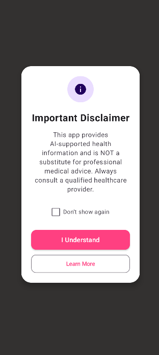<br>
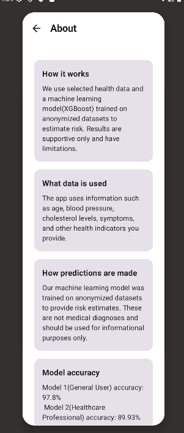<br>
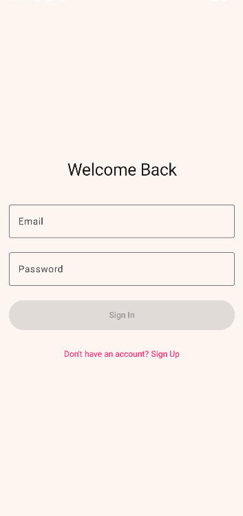<br>
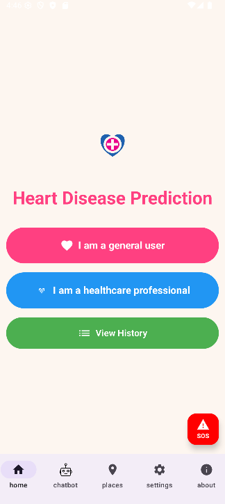<br>
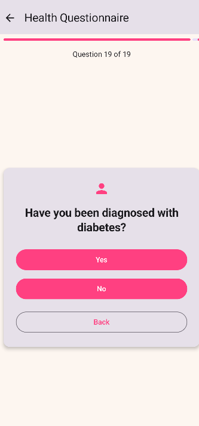<br>
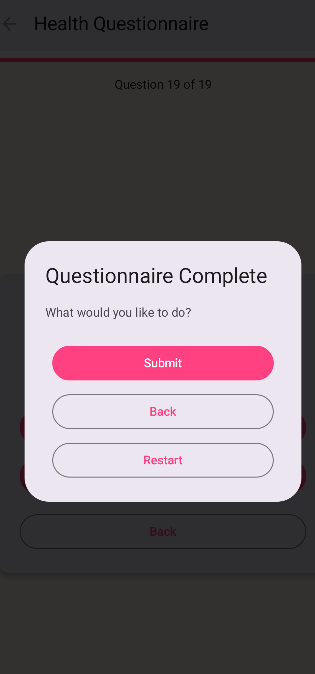<br>
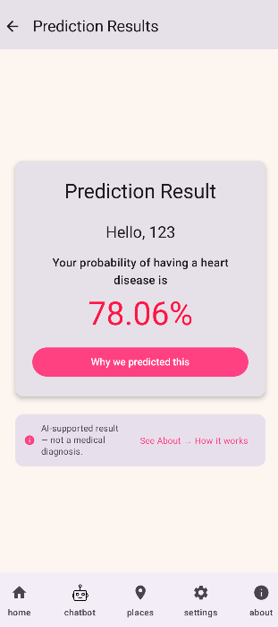<br>
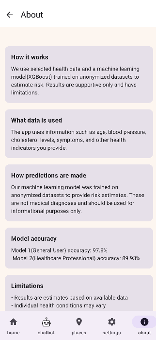<br>
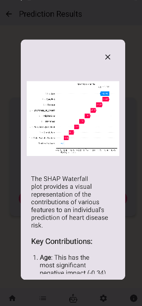<br>
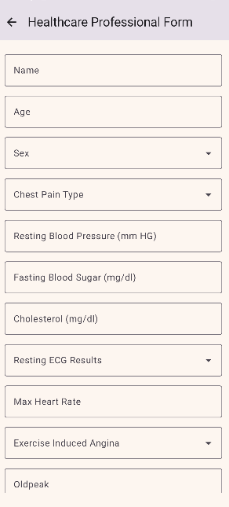<br>
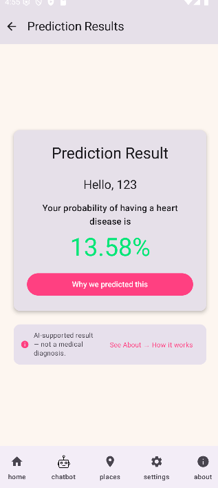<br>
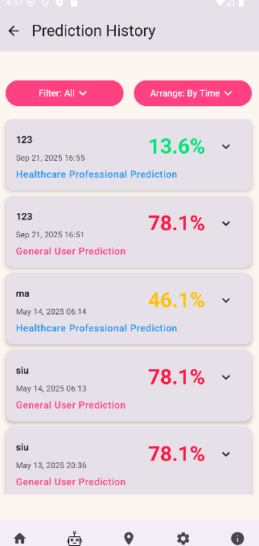<br>
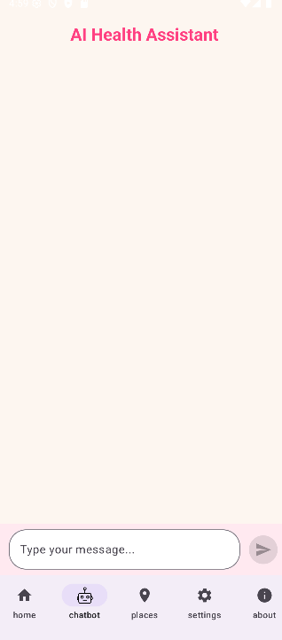<br>
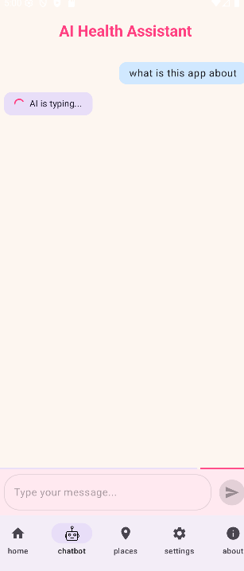<br>
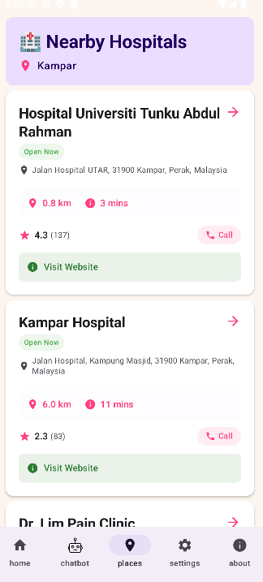<br>
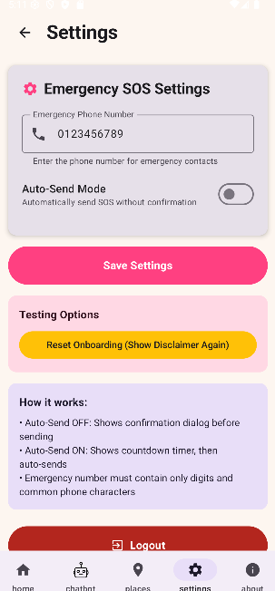<br>
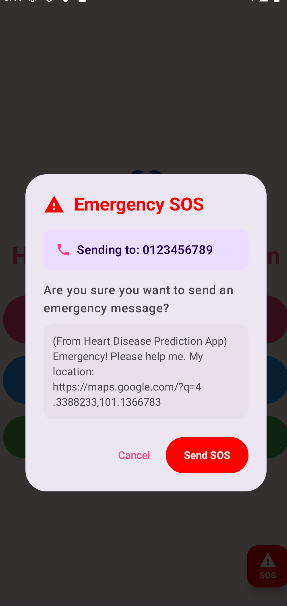<br>
